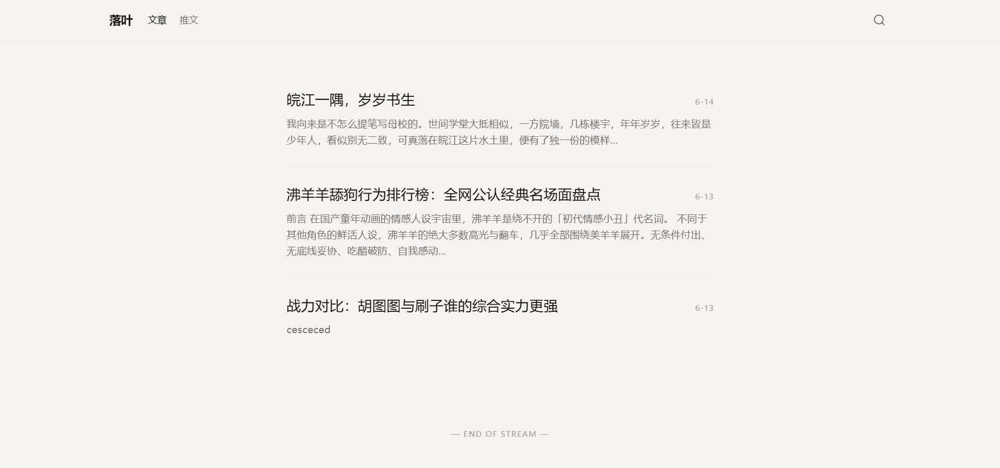
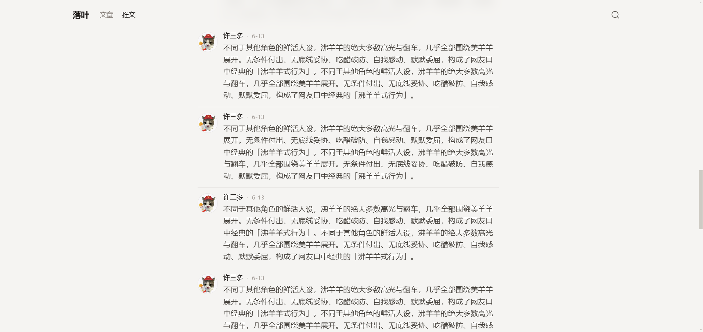
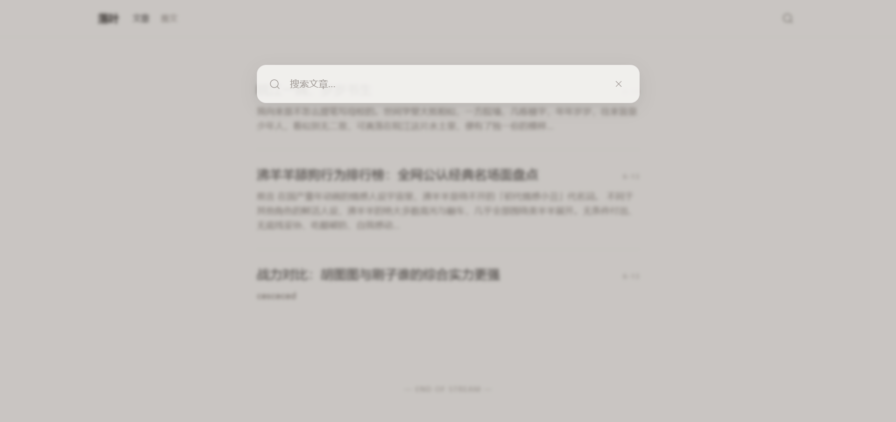
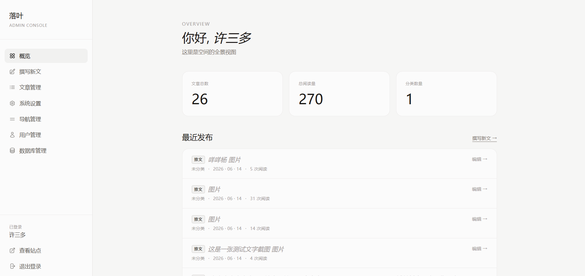
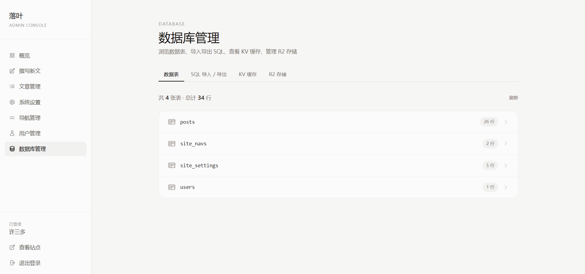

# FangPress · 一套基于 Cloudflare Pages D1 R2 KV 的极简博客系统

> 基于 **Cloudflare Pages + D1（SQLite）+ R2 + KV** 的一套**零服务器、零成本、纯静态前端 + 边缘函数**的极简独立博客系统。
> 主打「纯文字内容流」、强调阅读体验，配合 AI 写稿工作流与可视化后台，让单人独立博客的搭建与维护成本降到极限。


---

## ✨ 项目简介

**FangPress** 是一套完全跑在 Cloudflare 边缘网络上的个人博客系统，前端是纯 HTML + 原生 JS + **Tailwind CSS v4（预编译）**，后端逻辑全部用 **Pages Functions（Workers）** 实现，数据落地到 **D1**（Cloudflare 托管的 SQLite），图片落到 **R2** 对象存储，热点数据用 **KV** 做边缘缓存。

整套方案的特点：

- **零服务器**：不需要任何 VPS / 容器 / 域名备案；
- **零成本**：Cloudflare 免费额度足够个人博客跑到天荒地老；
- **零运维**：部署即上线，写文章走后台或 API；
- **本地发布**：支持本地php页面发布/修改文章，无需登录博客后台。
- **Ai提示词**：带AI提示词 [prompt.md](./prompt.md) ，直接喂给大模型即可生成符合本系统数据库结构的文章 JSON。
- **响应式自适应**：基于 Tailwind CSS v4 的响应式断点（`sm / md / lg / xl`）做了完整的**移动端 / 平板 / PC 三端适配**。
- **极致首屏**：Tailwind v4 在本地**预编译**为 `tailwind.css`（~40KB gzip），通过 `<link rel="preload">` + Cloudflare `_headers` 的 `immutable` 缓存实现二次访问 CSS **0 字节**加载；并把搜索浮层 / Tab 高亮 / 推文卡片三个原本内联在 HTML 里的 IIFE 抽到独立 JS 模块（同样 `immutable` 缓存），**二次访问几乎不消耗流量**。

---

## 🚀 功能特性

| 模块 | 说明 |
| --- | --- |
| 📝 文章管理 | 支持 Markdown 写作，文章 / 推文 `type` 分流，统一在 `/api/push` 一个端点写入 |
| 🐦 推文（轻量短内容） | 与文章共用 `posts` 表，`type='tweet'`；自动生成 `t-<时间戳>-<随机>` slug，title 可空 |
| 🧭 站点导航 | `site_navs` 表，后台可视化增删改 + 拖拽排序 + 启用/禁用，KV 缓存 + SSR 即时生效 |
| 🖼️ 图片管理 | 上传至 R2，Markdown 自动识别 `` 形式的图片，删除文章时联动清理 R2 对象 |
| 🔐 鉴权 | 单管理员模型，token = `SHA-256(password)`，支持环境变量 `API_TOKEN`（除账户接口外） |
| 👤 账户管理 | 改用户名 / 昵称 / 头像 / 密码；头像仅接受 http/https 直链 |
| 🗃️ 管理后台 | `admin*.html` 8 个页面（总览 / 文章 / 导航 / 设置 / 数据库 / 账户），零构建直接打开 |
| 📊 数据查看 | 后台「数据库」页支持 KV + D1 + R2 在线查看(R2存储支持删除操作) |

---

## � 页面预览

下面是项目实际跑起来后的几张关键页面截图，全部 360px～1920px 响应式自适应：

### 🏠 主页 / 文章 / 推文列表

| 文章列表 | 推文列表 | 搜索 |
| :---: | :---: | :---: |
|  |  |  |

### 🛠️ 管理后台

| 后台首页 | 数据库管理 |
| :---: | :---: |
|  |  |

> 📁 截图源文件位于 [screenshot/](./screenshot/) 目录。

---

## ⚡ 前端性能优化（边缘首屏方案）

> 这一节专门讲「**零构建**的前提下，怎么把首页打到一个非常激进的体积」。

FangPress 一直坚持**零构建**（没有 webpack / vite / rollup，所有 HTML / JS / CSS 都是源码直接扔到 Cloudflare Pages），但这并不意味着首屏慢 —— 通过下面这 6 步组合拳，公开页二次访问几乎可以做到 **0 网络流量**。

### 1. Tailwind CSS 改用「本地预编译」（干掉 CDN JIT）

旧方案是从 `cdn.jsdelivr.net` 拉 `tailwindcss/browser@4`（**~300KB JS**）到浏览器里运行时 JIT 编译 → 阻塞主线程 200~500ms。

新方案是**本地 `@tailwindcss/cli` 一次性预编译**为 `tailwind.css`（gzip 后 ~40KB）：

```bash
# 一行命令即可重新生成（项目里 [package.json](./package.json) 配好了）
npx @tailwindcss/cli -i ./src/input.css -o ./tailwind.css --minify
```

- 编译时把 HTML / JS 里**所有实际用到的 class** 都扫进去（`@source "./**/*.{html,js}"`），产物是「**静态 CSS 文件**」，无任何运行时；
- 删除后总产物体积下降 **~90%**，首屏 FCP 提升 200~500ms。

### 2. CSS 用 `<link rel="preload">` + 异步接管

所有公开页 head 里：

```html
<link rel="preload" href="/tailwind.css" as="style" onload="this.onload=null;this.rel='stylesheet'">
<noscript><link rel="stylesheet" href="/tailwind.css"></noscript>
```

- `preload` 浏览器**并行预取**，不等 CSS 解析完就能开始渲染骨架；
- `onload` 切换 `rel='stylesheet'` 实现「**非阻塞加载**」；
- `<noscript>` 兜底，防止 JS 关闭时全站没样式。

### 3. 二次访问 `immutable` 永久缓存

[_headers](./_headers) 里给所有静态资源加了 **一年永久缓存 + immutable**：

```text
/tailwind.css
  Cache-Control: public, max-age=31536000, immutable

/fancybox-loader.js
  Cache-Control: public, max-age=31536000, immutable
/search-overlay.js
  Cache-Control: public, max-age=31536000, immutable
/ui-common.js
  Cache-Control: public, max-age=31536000, immutable
/tweet-card.js
  Cache-Control: public, max-age=31536000, immutable
```

配合文件命名固定（永远叫 `tailwind.css`，不发新版本不换名），浏览器**永远命中 disk cache**：

- 二次访问 `tailwind.css` 走 `transferSize = 0` 字节加载；
- 新版本发布时改文件名（如 `tailwind.v2.css`）即可让旧用户**静默升级**。

### 4. 抽取共享 JS 模块（消除内联 IIFE 冗余）

旧版本每个 HTML 都内联了 `search overlay`、`tab highlight`、`tweet render` 的 IIFE，三个页面重复 3 份。新版本抽成**3 个独立文件**：

| 文件 | 职责 | 被谁引用 |
| --- | --- | --- |
| [ui-common.js](./ui-common.js) | 顶部 Tab 高亮 / 移动端菜单 toggle / 站点标题同步 | 所有公开页 |
| [search-overlay.js](./search-overlay.js) | 顶部搜索浮层（防抖 350ms、竞态 token、Esc 关闭） | `index.html` / `posts.html` / `tweets.html` |
| [tweet-card.js](./tweet-card.js) | 推文卡片渲染（**同构模块**） | `tweets.html`（CSR 懒加载）+ `functions/lib/list-render.js`（SSR）|

加载方式统一为 `defer`：

```html
<script src="/ui-common.js" defer></script>
<script src="/search-overlay.js" defer></script>
<script src="/fancybox-loader.js" defer></script>
<script type="module" src="/tweet-card.js"></script>  <!-- 仅 tweets.html -->
```

收益：
- 单页 HTML 体积从 ~30KB 降到 ~10KB；
- 抽出的 JS 走 `immutable` 永久缓存，**三个页面共享一份**，CDN 回源率 0；
- `tweet-card.js` 是**同构模块**（纯函数 + `export`），被 Functions 端 `import` 做 SSR、又被浏览器端 `<script type="module">` 做 CSR 懒加载追加，**两套渲染产出 HTML 字符级一致**，避免「首屏和加载更多」样式走样。

### 5. 外部 CDN 资源 `preconnect` 预建连

所有公开页 head 里：

```html
<link rel="preconnect" href="https://cdn.jsdelivr.net" crossorigin>
```

对第三方 CDN（Markdown 渲染需要的 marked.esm.js）提前**完成 DNS + TCP + TLS 握手**（约 100~300ms 节省），浏览器一发起请求就能直传。

### 6. 公开页 HTML 走「短缓存 + 边缘重新验证」

HTML 页面有内容更新需求（发了新文章 / 改了导航），不能像 CSS 那样永久缓存。折中策略：

- 浏览器：`max-age=10`（10 秒内不重复请求，最多省一次 RTT）；
- CDN：`s-maxage=300`（边缘 5 分钟缓存，给全球所有用户复用）；
- 后台写操作（`/api/push` 等）里**主动 purge 对应 KV 键**，确保用户感知**准实时**生效。

---

## 🚀 快速开始

部署一个 FangPress 实例只需 5 步：

> 💡 也可以不 Fork 仓库，**直接下载本项目压缩包 → Cloudflare Pages → Upload assets**（直接上传）也完全可以，绑定、SQL 初始化等步骤与下方一致。

1. **Fork / Clone** 本仓库到你的 GitHub（或者下载 ZIP 压缩包）。
2. 在 **Cloudflare Dashboard** 创建一个 Pages 项目并连接该仓库 / 上传压缩包（构建命令留空，构建输出目录留空即可，全是静态资源 + Functions）。
3. 在 Cloudflare 创建 **D1 数据库**、**R2 存储桶**、**KV 命名空间**，并绑定到 Pages（详见下方 [☁️ Cloudflare 控制台配置](#️-cloudflare-控制台配置)）。
4. 在 Pages 控制台的 **「设置 → 环境变量」** 配置 `API_TOKEN` 等（详见下方 [☁️ Cloudflare 控制台配置](#️-cloudflare-控制台配置)）。
5. 首次部署完成后，进 D1 控制台的查询页面 **执行 [sql.txt](./sql.txt) 中的语句** 初始化表结构与默认管理员。

<div style="text-align:center; font-size:1.4em; font-weight:600; padding:1.2em 0; margin:1em 0; border-top:1px dashed #ccc; border-bottom:1px dashed #ccc;">

🚀 部署完成访问你的地址（默认地址 `https://<your-project>.pages.dev`），默认账号密码 `admin / admin`，**登录后立刻改密码**。

</div>

---

## ☁️ Cloudflare 控制台配置

### 1. 创建 Pages 项目

1. 登录 [Cloudflare Dashboard](https://dash.cloudflare.com/) → **Workers & Pages** → **Create** → **Pages** → **Connect to Git**。
2. 选择本仓库，框架预设选 **None**。
3. **Build command** 留空，**Build output directory** 留空（项目无构建步骤，纯静态 + Functions）。
4. 点击 **Save and Deploy**，等首次部署完成（此时 Functions 会因尚未绑定资源而 500，**正常**）。

### 2. 创建 D1 / R2 / KV 资源

> 这一步**不展开教程**，请自行 Cloudflare 后台操作（搜索「Cloudflare Pages 创建 D1/R2/KV」即可查到大量图文），流程简述：
> 三者创建好后，回到 Pages 项目 → **Settings → Bindings** 添加绑定（详见下一节）。

### 3. 绑定到 Pages Functions（⚠️）

进入 Pages 项目 → **Settings**，添加 **绑定**。绑定时给的「变量名」必须**与下表一字不差**，否则直接500。

| 类型 | 变量名（**必须严格一致**） | 绑定到 |
| --- | --- | --- |
| D1 数据库 | `DB` | 你上一步建的 D1 |
| R2 存储桶 | `R2_BUCKET` | 你上一步建的 R2 桶 |
| KV 命名空间 | `KV` | 你上一步建的 KV |


### 4. 配置环境变量 / 密钥（⚠️）

Pages 项目 → **Settings → Variables and Secrets → Add**，添加 **2 个环境变量**：

| 类型 | 名称（**必须严格一致**） | 值（示例） |
| --- | --- | --- |
| 纯文本 | `API_TOKEN` | `GhzoDocLALRbPwhqztrhimYgkvEa`（任意随机强字符串） |
| 纯文本 | `R2_PUBLIC_URL` | `https://xxxx.xxx`（你的 R2 桶公开访问域名，**末尾不要带 `/`**） |

> ⚠️ 改完一定要 **重新部署一次** 才生效。

### 5. 初始化数据库（执行 SQL）

1. Cloudflare Dashboard → **Workers & Pages → Storage → D1** → 选中你建的 D1→ **Query** 标签。
2. 点开下方折叠的 **「👉 点击展开SQL」**  SQL 复制，粘贴到输入框，点击 **Run**（源文件[sql.txt](./sql.txt)，不要一次性运行全部，一次只能运行一条语句）
<details>
<summary>👉 点击展开完整 SQL</summary>

```sql

DROP TABLE IF EXISTS site_navs;
DROP TABLE IF EXISTS site_settings;
DROP TABLE IF EXISTS posts;
DROP TABLE IF EXISTS users;

CREATE TABLE users (
    id INTEGER PRIMARY KEY AUTOINCREMENT,
    username TEXT UNIQUE NOT NULL,
    password_hash TEXT NOT NULL,
    nickname TEXT,
    avatar TEXT,
    created_at TEXT NOT NULL
);


CREATE TABLE posts (
    id INTEGER PRIMARY KEY AUTOINCREMENT,
    title TEXT,
    slug TEXT UNIQUE NOT NULL,
    content TEXT NOT NULL,
    excerpt TEXT DEFAULT '',
    category TEXT DEFAULT '未分类',
    type TEXT NOT NULL DEFAULT 'post',
    views INTEGER DEFAULT 0,
    status TEXT DEFAULT 'published',
    author_id INTEGER,
    created_at TEXT NOT NULL,
    updated_at TEXT NOT NULL,
    FOREIGN KEY (author_id) REFERENCES users(id)
);

CREATE INDEX idx_posts_slug ON posts(slug);
CREATE INDEX idx_posts_category ON posts(category);
CREATE INDEX idx_posts_status ON posts(status);
CREATE INDEX idx_posts_type ON posts(type);

CREATE TABLE site_settings (
    key   TEXT PRIMARY KEY,
    value TEXT NOT NULL,
    updated_at TEXT NOT NULL
);

INSERT INTO users (username, password_hash, nickname, created_at) VALUES
    ('admin', '8c6976e5b5410415bde908bd4dee15dfb167a9c873fc4bb8a81f6f2ab448a918', 'Admin', '2026-06-12T05:00:00.000Z');

INSERT INTO site_settings (key, value, updated_at) VALUES
    ('site_title',     'Quinn''s Space',                                        '2026-06-12T05:00:00.000Z'),
    ('site_subtitle',  '基于 Cloudflare Pages & D1 关系型数据库的纯文字内容流',    '2026-06-12T05:00:00.000Z'),
    ('show_views',     '1',                                                     '2026-06-12T05:00:00.000Z'),
    ('excerpt_length', '200',                                                   '2026-06-12T05:00:00.000Z'),
    ('home_mode',      'mix',                                                   '2026-06-12T05:00:00.000Z');

CREATE TABLE site_navs (
    id INTEGER PRIMARY KEY AUTOINCREMENT,
    label TEXT NOT NULL, 
    href  TEXT NOT NULL,
    tab_key TEXT DEFAULT NULL,
    open_in_new_tab INTEGER NOT NULL DEFAULT 0,
    is_active     INTEGER NOT NULL DEFAULT 1,
    sort_order    INTEGER NOT NULL DEFAULT 0,
    created_at TEXT NOT NULL,
    updated_at TEXT NOT NULL
);
CREATE INDEX idx_site_navs_active ON site_navs(is_active, sort_order);

INSERT INTO site_navs (label, href, tab_key, open_in_new_tab, is_active, sort_order, created_at, updated_at) VALUES
    ('文章', '/posts',  'posts',  0, 1, 10, '2026-06-12T05:00:00.000Z', '2026-06-12T05:00:00.000Z'),
    ('推文', '/tweets', 'tweets', 0, 1, 20, '2026-06-12T05:00:00.000Z', '2026-06-12T05:00:00.000Z');
```

</details>


#### 🔐 默认账号与安全建议

| 项 | 默认值 |
| --- | --- |
| 用户名 | `admin` |
| 密码（明文） | `admin` |
| 密码（SHA-256） | `8c6976e5b5410415bde908bd4dee15dfb167a9c873fc4bb8a81f6f2ab448a918` |

⚠️ **首次登录后请立即**：
1. 进入 **控制台 → 账户信息** 修改用户名/密码；

---

## 🔌 API 二次开发

FangPress 的后端**完全 API 驱动**：网页 / 后台只是「壳」，所有写操作（发布 / 修改 / 删除文章、上传图片、修改站点设置、改导航、改账户）最终都走 [api.md](./api.md) 里的 API。**任何能发 HTTP 请求的程序都是合法客户端** —— 浏览器、手机 App、CLI、CI 脚本都可以。

### 本地 PHP 后台 = API 的一个客户端

仓库自带的 [php/](./php) 目录并不是一个独立的后台，它只是 [api.md](./api.md) 的一个 **PHP 客户端**：

| PHP 里的动作 | 实际调用 |
| --- | --- |
| 「发布」按钮 | `POST /api/push`（带 Bearer Token） |
| 「保存修改」按钮 | `POST /api/update` |
| 「删除」按钮 | `POST /api/delete` |
| 「上传图片」 | `POST /api/upload` |
| 「加载详情」 | `GET  /api/get?slug=...` |

PHP 端仅做了两件事：
1. **服务端代理请求**：用 `curl` 在 PHP 里转发 HTTP，**绕开浏览器 CORS**（Pages Functions 默认同源，但本地 `php -S` 起服务时跨域了）；
2. **渲染一个比后台更轻的表单 UI**：方便在本地起一个 `php -S 0.0.0.0:8000` 就能直接写文章。

所以**本地 PHP 发布 = 走的就是 API**，和网页后台是同一条路。读懂 [api.md](./api.md) 后，你完全可以：

- 写个 **VSCode 插件** 直接 publish（POST `/api/push`）；
- 用 **Obsidian / Typora** 写完导出，一键 curl 上传；
- 写个 **手机端 App** 远程管理；
- 接入 **CI**：GitHub Actions 监听新 Markdown 文件 → 自动调 `/api/push` 发布。

### 最简 curl 示例

发布一篇文章（用 `API_TOKEN` 鉴权，无需登录）：

```bash
curl -X POST https://your-domain/api/push \
  -H "Authorization: Bearer $API_TOKEN" \
  -H "Content-Type: application/json" \
  -d '{
    "title":    "Hello World",
    "slug":     "hello-world",
    "content":  "# 这是我的第一篇文章\n\n正文 Markdown...",
    "category": "随笔",
    "type":     "post"
  }'
```

> 📘 完整 11 个端点 + 鉴权 / 错误码 / 缓存策略 / 批量删除 / 拖拽排序等高级用法：[api.md](./api.md)
> 🛠️ 本地 PHP 后台用法见 [php/index.php](./php/index.php) 顶部注释，先把 [php/config.php](./php/config.php) 里的 `API_BASE` / `API_TOKEN` 改成你自己的域名和 Pages 环境变量即可。

---

## ⚠️ 重要：前端页面的 SSR 渲染机制（改造前必读）

FangPress **公开页面（首页 `/`、文章列表 `/posts`、推文列表 `/tweets`、文章详情 `/post/:slug`、推文详情 `/tweet/:slug`）一律走 Pages Functions 服务端渲染（SSR）**，和后台 `admin-*.html` 完全不同：

### 🔁 两种渲染方式对比

| 维度 | 公开页面（SSR） | 管理后台（CSR） |
| --- | --- | --- |
| 文件 | `index.html` / `posts.html` / `tweets.html` / `post.html` / `tweet.html` | `admin.html` + `admin-*.html` 8 个 |
| 渲染时机 | **请求时**在 Cloudflare 边缘节点用 Functions 把 HTML 拼好再返回 | 浏览器端 JS fetch `/api/*` 后动态渲染 |
| 首屏 | 一次性返回**完整 HTML**（含正文 / 标题 / 日期 / 摘要 / 导航） | 一个空壳 + 多次 fetch 拉数据 |
| 改主题/样式 | **要改两处**（HTML 静态模板 + `functions/lib/*.js` 的 SSR 渲染器） | 只改 `admin-*.html` |
| SEO / 分享 | 极好（搜索引擎 / 微信 / Telegram 卡片能直接抓到正文） | 不友好（首屏是空的） |

### 📂 想改主题 / 样式 / 卡片排版时，**必须同时改**的两类文件

#### 1. 静态 HTML 模板（浏览器端兜底骨架）

- [index.html](./index.html) — 主页骨架
- [posts.html](./posts.html) — 文章列表骨架
- [tweets.html](./tweets.html) — 推文列表骨架
- [post.html](./post.html) — 文章详情骨架
- [tweet.html](./tweet.html) — 推文详情骨架
- [404.html](./404.html) — 404 页

> 这些 HTML 里通常含 `<div id="ssr-post-list"></div>`、`#ssr-site-title` 等「**SSR 注入点**」，Functions 会把渲染好的 HTML 字符串塞进这些节点。骨架 CSS（字体、颜色、容器宽度、阅读器样式）就定义在这些文件里。

#### 2. Functions 端的 SSR 渲染器（真正负责拼内容）

| 文件 | 职责 |
| --- | --- |
| [functions/index.js](./functions/index.js) | 主页 `/` 的路由 + SSR |
| [functions/posts.js](./functions/posts.js) | `/posts` 列表 SSR（带上下页分页） |
| [functions/tweets.js](./functions/tweets.js) | `/tweets` 列表 SSR（带首屏数据 + 懒加载元信息） |
| [functions/post/[slug].js](./functions/post/%5Bslug%5D.js) | 文章详情 SSR |
| [functions/tweet/[slug].js](./functions/tweet/%5Bslug%5D.js) | 推文详情 SSR |
| **[functions/lib/list-render.js](./functions/lib/list-render.js)** | ⭐ **列表项的 HTML 模板**（标题字号、摘要样式、推文 R2 卡片、桌面/移动端日期布局、动画 `fade-up` 等）。推文卡片的 SSR 渲染委托给根目录的同构模块 [tweet-card.js](./tweet-card.js)，**避免与浏览器端懒加载逻辑双写**。|
| **[tweet-card.js](./tweet-card.js)** | ⭐ **同构推文卡片渲染器**（纯函数 + `export`），Functions 端 import 做 SSR，浏览器端 `<script type="module">` 做 CSR 懒加载追加，**两套环境字符级一致** |
| [functions/lib/nav-render.js](./functions/lib/nav-render.js) | header 导航的 HTML |
| [functions/lib/marked.esm.js](./functions/lib/marked.esm.js) | Markdown → HTML（决定正文里代码块 / 引用 / 列表怎么渲染） |
| [functions/lib/r2-images.js](./functions/lib/r2-images.js) | 抽取 R2 图片 key + 删除联动 |
| [functions/lib/time.js](./functions/lib/time.js) | 时间格式化 |

> 📌 **举个最常见的踩坑场景**：你嫌「文章列表的标题字号太大」，只改了 `index.html` 里的 CSS，结果**首页首页**（首次访问、SSR）字体没变，要 Ctrl+F5 强刷也没用 —— 因为 SSR 是在 `functions/lib/list-render.js` 里把 HTML 字符串拼好后塞进去的，**那个拼好的 `<h2>` 才是真正控制字号的源头**。同理，文章正文的样式是 `functions/lib/marked.esm.js` 决定的，不是 `post.html`。推文卡片的视觉样式（图片、头像、动效）由 [tweet-card.js](./tweet-card.js) 一份代码同时服务 SSR 和 CSR，**改它一处即可**。

### 🧪 怎么验证你的修改对 SSR 生效？

1. 改完先 `git commit` → push，让 Pages 自动重新部署；
2. 浏览器打开页面 → **右键 → 查看网页源代码**（不是 F12 Elements）；
3. 在源码里直接搜你改的 class / 文字 / 样式规则 —— **能搜到** 就说明 SSR 已生效；搜不到就是只改了 HTML 模板，Functions 没读到。

> 看到「View Source: `<h2 class="font-serif text-xl ...">我的标题</h2>`」这样的源码，**就对了**。说明标题是 SSR 拼出来的，不是浏览器后填的。

### 🚫 不要改的地方

- `functions/api/*` 下的 JSON 接口（`/api/list`、`/api/push` 等）—— 这是数据层，**只返回 JSON**，不输出 HTML，改了会让公开页 500；
- `sql.txt` 里的字段 —— 改完记得同步改 `functions/api/*` 里的 SQL，否则读写不一致。

---

## ❓ 常见问题

<details>
<summary><b>Q1：部署后页面打开 500 / API 全部 500？</b></summary>

大概率是 D1 / R2 / KV 没绑定，或者变量名不是 `DB` / `R2_BUCKET` / `KV`。回 **Pages → Settings → Functions** 三个 binding 都检查一遍，再 **重新部署** 一次。

</details>

<details>
<summary><b>Q2：D1 Console 粘贴 <code>sql.txt</code> 报错「table already exists」？</b></summary>

脚本里第一段是 `DROP TABLE IF EXISTS ...`，在 D1 Console 里**一次执行整段**即可。如果只挑了 INSERT 部分单独执行就会冲突。

</details>

<details>
<summary><b>Q3：改了设置 / 发了文章，首页没立刻更新？</b></summary>

KV 缓存键 `site:posts:list:*` / `site:navs:list:active` 写时**已主动清空**，理论上即时生效。如仍异常：
- Pages → **Settings → Functions → KV** 里点 **「Clear data」** 即可清空全部缓存。
- 或进 D1 Console 跑：`DELETE FROM posts WHERE id=...;` 后再观察。

</details>

<details>
<summary><b>Q4：想换域名？</b></summary>

Pages → **Custom domains → Set up a custom domain** → 按提示加 CNAME 即可，证书自动签发。

</details>

<details>
<summary><b>Q5：图片上传到 R2 后，Markdown 里怎么写？</b></summary>

直接写标准的 Markdown 图片语法即可：

```markdown

```

只要 `R2_PUBLIC_URL` 配对，删除文章时会**自动联动清理**对应 R2 对象。

</details>

<details>
<summary><b>Q6：没有我遇到的问题?</b></summary>

问ai

</details>

---

## 📝 License
MIT License. 详见 [LICENSE](./LICENSE)（如未提供，按 MIT 默认理解，欢迎自由 fork / 二次开发）。
---
> 文档版本：2026-07-02
> 配套：[**api.md**](./api.md) · [**prompt.md**](./prompt.md) · [**sql.txt**](./sql.txt)
